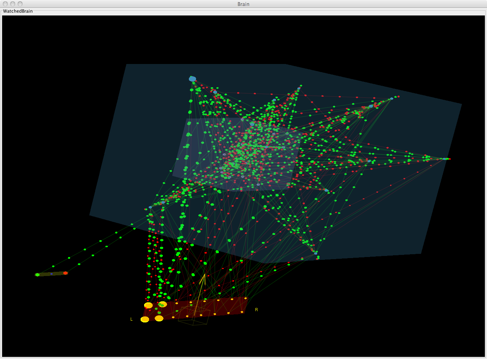
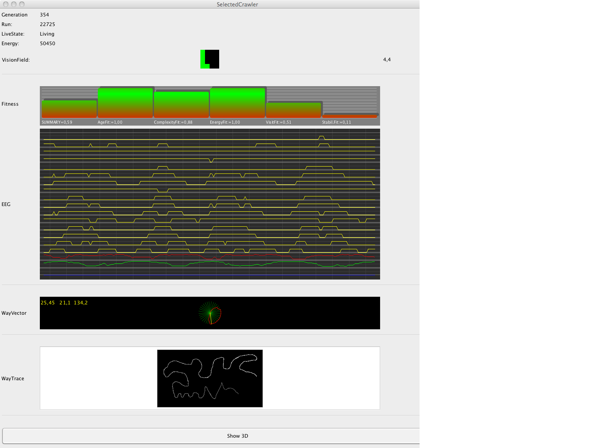
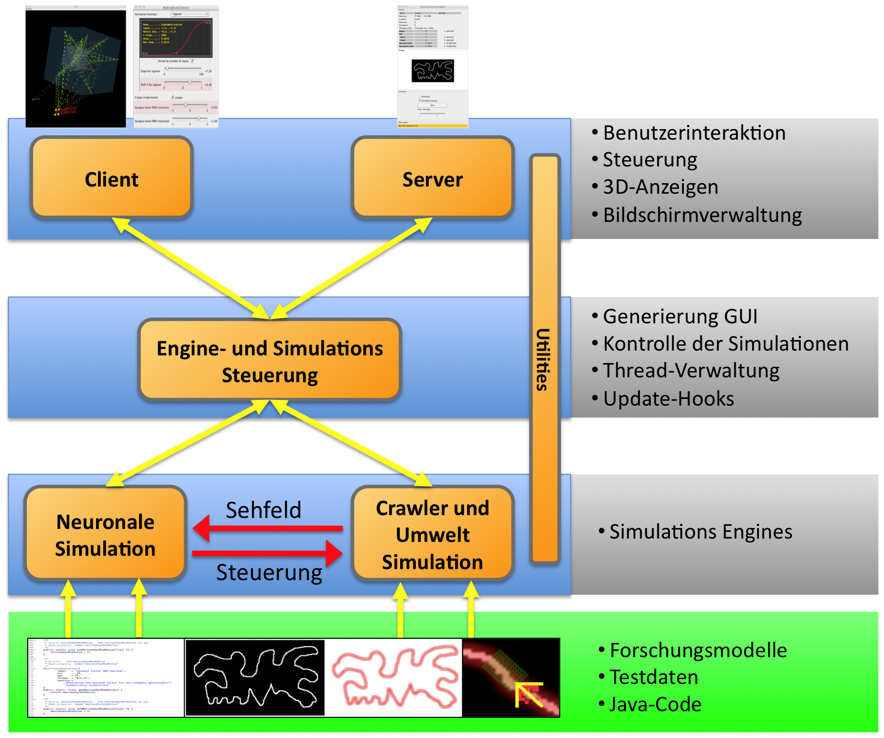

# EvolutionBrain

> **Note:** This is old source code from 2011, written for my (Thomas Welsch's) master thesis. It
> has since been modernized to build and run on current JDKs/Maven (see [AGENTS.md](AGENTS.md) for
> details), but the design and neural-network/mutation code itself are intentionally left as they
> were.

## What is this

A framework for experiments with randomly generated neuronal networks driven by mutation and
selection (i.e. evolution), with a 3D visualisation of the resulting brains/networks. Built as the
practical component of my 2011 master thesis
(see [Master-Thesis/Master–Thesis-Thomas-Welsch_2011_06_14.pdf](Master-Thesis/Master–Thesis-Thomas-Welsch_2011_06_14.pdf)).

## Screenshots

| Evolved 3D brain visualisation | Live crawler dashboard (fitness, EEG, path trace) |
|---|---|
|  |  |

Architecture overview (from the thesis):



More figures are available under [Master-Thesis/Bilder.Export/](Master-Thesis/Bilder.Export/).

## Status

Fully functional again after modernization: main sources compile, `mvn test` passes all suites,
and `mvn compile exec:java` launches the demo (see below). Look at
[src/main/java/tw/master/MasterProofMain.java](src/main/java/tw/master/MasterProofMain.java) for a
starting point.

See [AGENTS.md](AGENTS.md) for the full modernization background/plan,
[assessment.md](assessment.md) for a candid code-quality review, and
[copyrights.md](copyrights.md) for third-party material used with permission.

## Quick start

```sh
mvn compile exec:java
```

This compiles the project and launches `MasterProofMain`: it starts the evolution engine, loads
`images/Trails.png`, and opens the Swing/JOGL 3D visualisation window.

> **Caution:** running the app can write frame captures to `./film/*.png` (disabled by default now,
> see `GlobalsClientGui.ip.writeImage`) — check `git status` on `film/` before committing if you
> turn that back on.

## Development environment (2011, historical)

- Eclipse / Maven and a own Maven-Repository.
- Project was integrated in a Jenkins CI system.
- Using the subversion system
- Using jUnit for tests
- Start working on Checkstyle and PMD metrics for improving code quality

The [install_foreign_jar_to_develop_repository.sh](install_foreign_jar_to_develop_repository.sh)
and [install_jars_for_maven.sh](install_jars_for_maven.sh) scripts are leftovers from that 2011
setup (installing vendored JOGL/GlueGen/JOCL/JMDNS jars into a private "Spontech" Maven repository
that no longer exists). They are unused today — the current `pom.xml` pulls those dependencies
directly from Maven Central instead.

## License

See [LICENSE.txt](LICENSE.txt) / [license/](license/) for the GPL/LGPL license texts.
